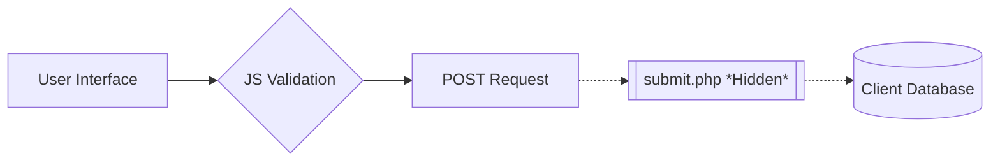

# 🚗 Elite Car Rental – Premium Client Interface

A high-performance, responsive web-based client application engineered for modern car rental services. This project serves as the sophisticated frontend layer for a complete rental ecosystem, focusing on user conversion and seamless UI/UX.

> 🔒 **Confidentiality Notice:** This repository contains the **Client-Side Frontend architecture**. All proprietary backend logic, including `submit.php` and database schemas, have been excluded to protect client intellectual property.

---

## ✨ Features

### 🎯 Core Capabilities

* **Dynamic Fleet Showcase**: High-resolution display of vehicle categories with spec highlights.
* **Tiered Pricing Architecture**: Clearly defined rental plans (Daily, Weekly, Monthly).
* **Inquiry Logic**: Interactive contact system designed for high-conversion lead generation.
* **Responsive Fluidity**: Optimized for 4K Desktops, Tablets, and Mobile devices using CSS Flex/Grid.

### 📱 User Journey & Pages

* **🏠 Dashboard (Home)**: High-impact hero section with primary Call-to-Action (CTA).
* **🚘 Virtual Showroom (Cars)**: Categorized list of vehicles with detailed technical specs.
* **💰 Plan Selector (Pricing)**: Comparative view of rental packages and loyalty discounts.
* **🛠️ Service Suite (Services)**: Breakdown of value-added offerings (Chauffeur, Insurance, 24/7 Support).
* **📖 Brand Story (About)**: Corporate mission, values, and fleet standards.
* **📩 Lead Portal (Contact)**: Validated inquiry form with automated data-entry hooks.

---

## 🔧 Technical Workflow



---

## 📋 Project Structure

```bash
Car-Rental-Service-Client-Project/
├── index.html          # Main Application Entry Point
├── cars.html           # Vehicle Catalog Management
├── pricing.html        # Financial Plan Interface
├── services.html       # Service Offering Logic
├── about.html          # Brand Identity Module
├── contact.html        # Lead Capture Portal
├── css/
│   └── style.css       # Global Design System (Custom CSS3)
├── js/
│   └── script.js       # UI Interactivity & Form Validation
├── images/             # High-Resolution Fleet Assets
└── .gitignore          # Environment & Backend Protection

```

---

## 🚀 Deployment & Installation

### 1. Local Environment

Clone the repository to your local directory:

```bash
git clone https://github.com/paricharm/Car-Rental-Service-Client-Project-.git

```

### 2. Execution

* **Direct Access:** Open `index.html` in any Chromium-based browser.
* **Developer Mode (Recommended):** 1. Open in VS Code.
2. Launch via **Live Server** (Port 5500) to ensure path consistency.

---

## 📊 Feature Breakdown & Logic

### 1. Form Validation (JavaScript)

The system uses a robust frontend validation layer to ensure data integrity before submission:
| Field | Validation Logic | Error Handling |
| :--- | :--- | :--- |
| **Name** | Regex: String only | "Please enter a valid name" |
| **Email** | Standard RFC 5322 | "Check email format" |
| **Phone** | Numeric (10-12 digits) | "Invalid phone number" |

### 2. Fleet Display Optimization

* **Lazy Loading**: Images are optimized for fast initial page paint.
* **Flexbox Grid**: Ensures vehicle cards remain uniform across all screen widths.

---

## ⚙️ Configuration & Integration

### Backend Connection

To connect the frontend to your own server, locate the form tag in `contact.html`:

```html
<form action="your_backend_endpoint" method="POST">

```

### Styling Customization

The UI is built on a **Modular CSS** principle. You can update the primary brand colors by modifying the root variables in `css/style.css`:

```css
:root {
  --primary-color: #ff3300; /* Car Rental Theme Red */
  --accent-color: #1a1a1a;
}

```

---

## 🛠️ Troubleshooting

### Images Not Loading

* Ensure the `images/` directory path is correct.
* Check case-sensitivity (e.g., `Car.jpg` vs `car.jpg`).

### Form Redirection Error

* Since `submit.php` is excluded, the form will return a **404 error** upon submission. This is expected behavior for this public repository. Replace with a live endpoint for testing.

---

## 📈 Future Enhancements

* [ ] **Interactive Map**: Integration of Google Maps API for branch locations.
* [ ] **Live Booking Engine**: Conversion from inquiry-only to real-time checkout.
* [ ] **Dark Mode Support**: System-wide theme toggling.
* [ ] **JSON Fleet Feed**: Migrating static HTML cars to a dynamic JSON-driven list.

---

## 📄 License & Terms

* **Type**: Portfolio/Educational Release.
* **Commercial Use**: Prohibited without explicit client consent.
* **Backend**: Not included for security and privacy reasons.

---

**Crafted with precision for high-end automotive rental solutions.**

Would you like me to help you create a specific **CSS Color Theme** or **JavaScript Validation Script** to include in these folders?
